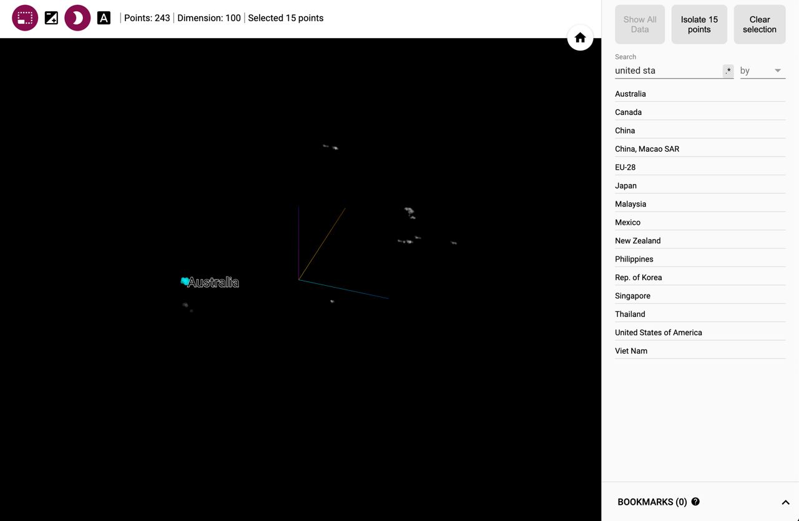
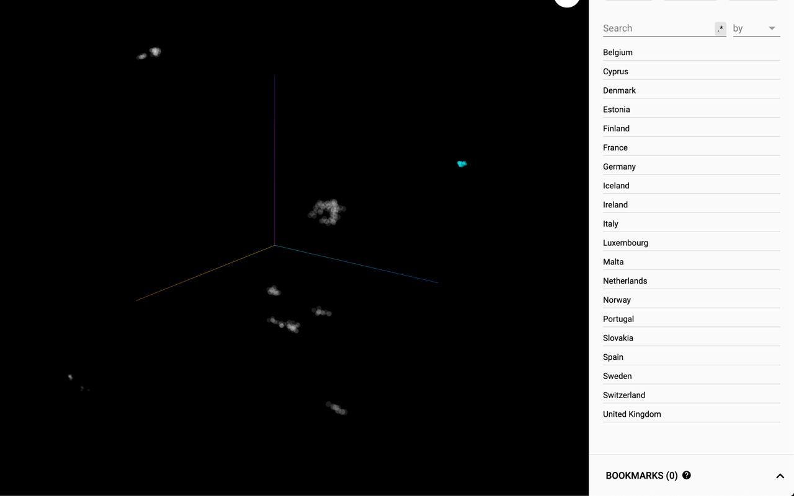
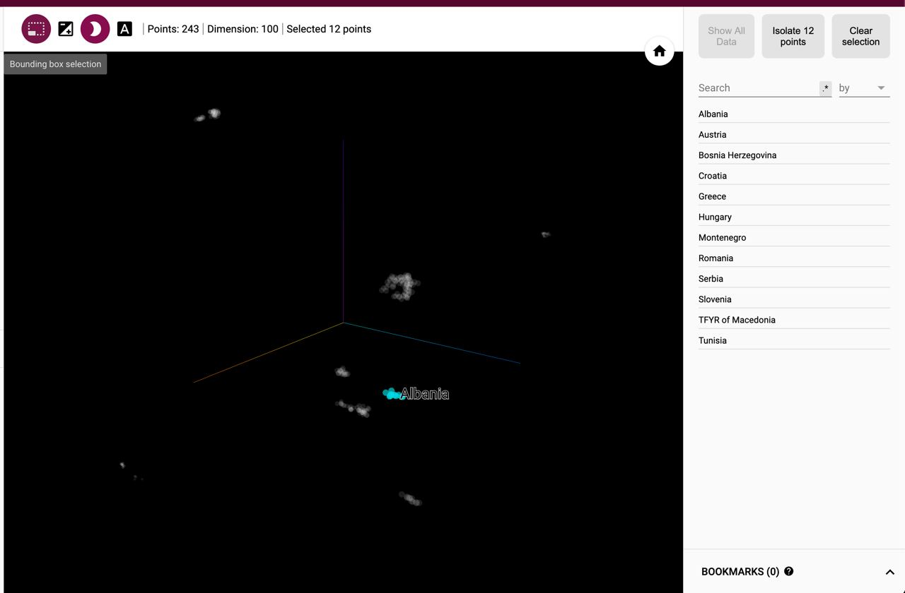
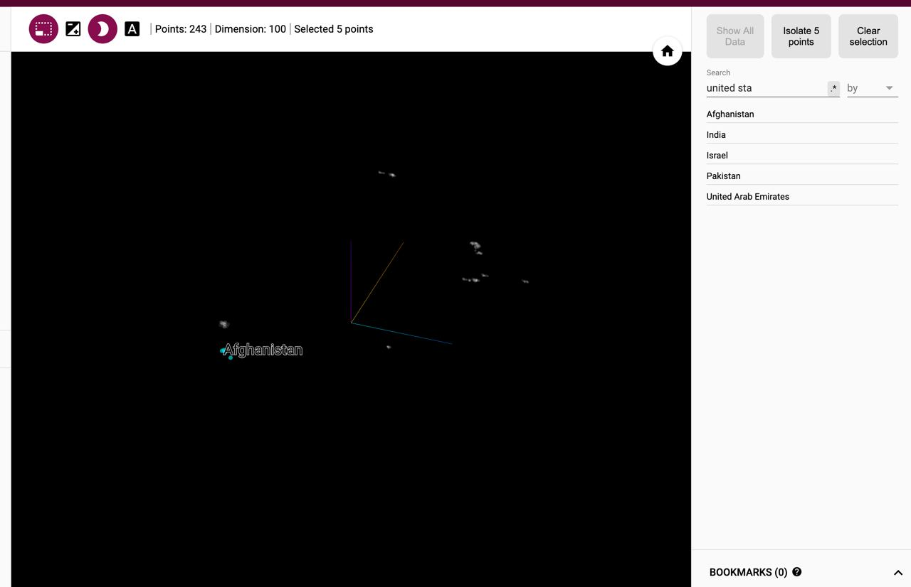
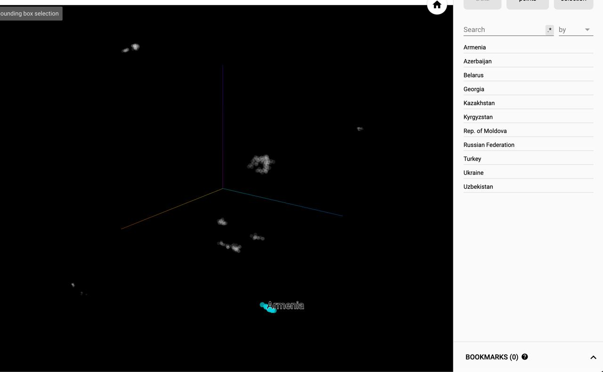
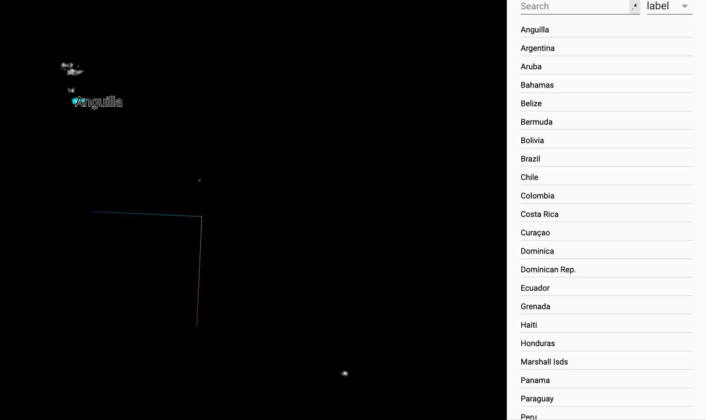
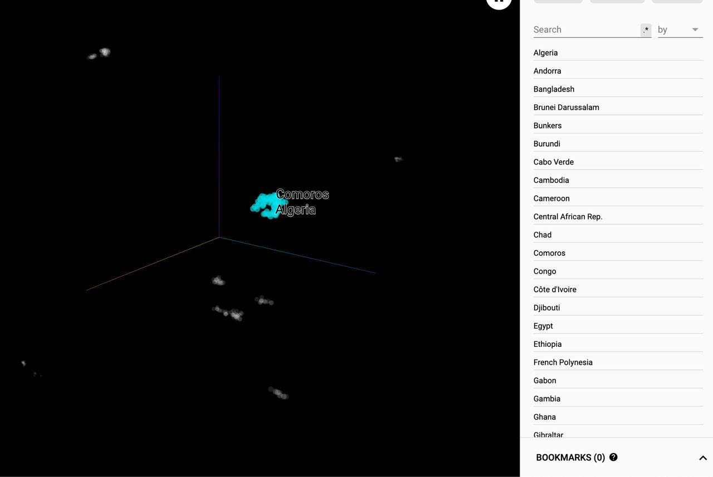
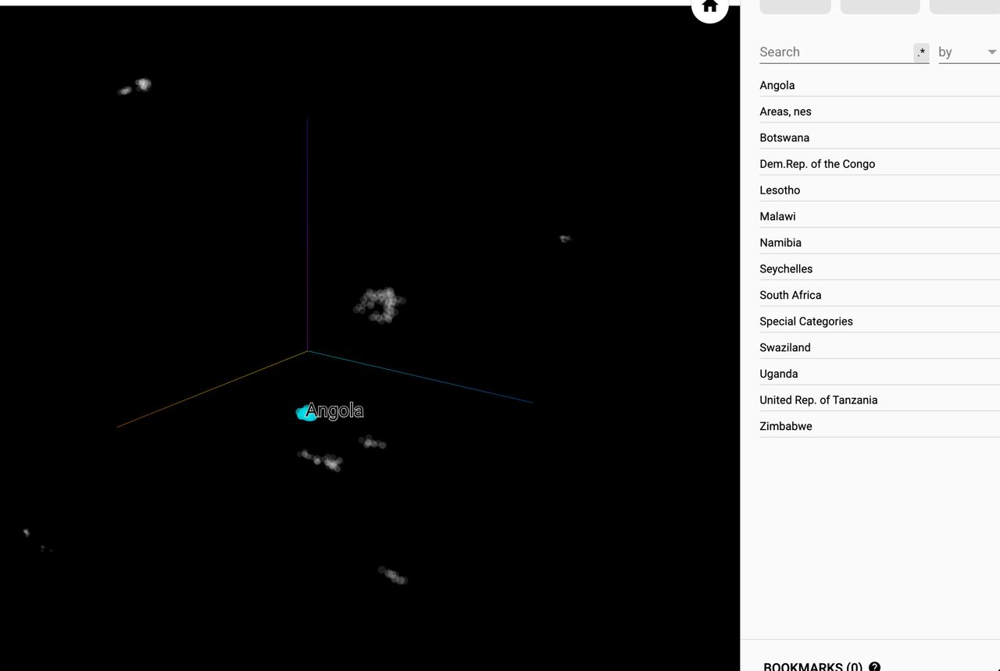
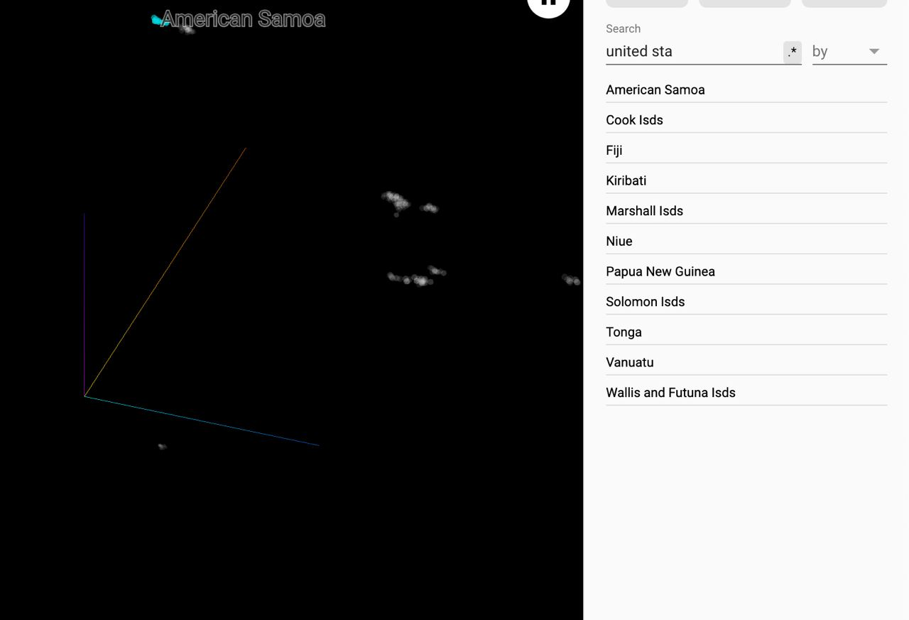

# Knowledge Graph Embedding of UNComtrade Data

## Data & Model
- data used : hs-6-digit, reported for May 2020
```
(samples)
Hungary,Exports_401190,Greece,74
Hungary,Exports_401190,United Kingdom,37953
Hungary,Exports_401190,Poland,4125
Hungary,Exports_401190,Netherlands,9030
Hungary,Exports_401190,Ukraine,22035
Hungary,Exports_401190,Belgium,31297
Hungary,Exports_401190,Portugal,926
Hungary,Exports_401190,Slovakia,2618
Hungary,Exports_401190,Sweden,80747
Hungary,Exports_401190,Finland,24131
Hungary,Exports_401190,Slovenia,1798
Hungary,Exports_401190,Bulgaria,11186
Hungary,Exports_401190,Germany,15729
Hungary,Exports_401190,Italy,106409
Hungary,Exports_401190,Austria,171100
...
```
- model used : [TransE](http://papers.nips.cc/paper/5071-translating-embeddings-for-modeling-multi-relational-data.pdf)

## [Google Embedding Projector](http://projector.tensorflow.org/?config=https://gist.githubusercontent.com/syyunn/95a48c201841d4de0314bdfc0f17aef4/raw/abe5ddff261d874f503dffcdfa659a84603bf2db/config.json)
Uploaded trained embeddings to the Google Embedding Projector so that people can interactiely look into the result. (click the hyperlink in the title)

## Figures
### T-SNE Clustering (Perplexity: 5, Learning Rate: 1 Steps: 8K)
<p align=center></p>

### Trans-Pacific Group
<p align=center></p>

### Europe
<p align=center></p>

### Eastern Europe
<p align=center></p>

### Arabian Sea Group
<p align=center></p>

### Former Soviet Union Group
<p align=center></p>

### South America
<p align=center></p>

### Africa Group
<p align=center></p>

### Southern Africa Group
<p align=center></p>

### Islands Group
<p align=center></p>

